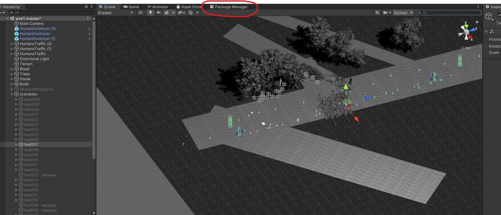
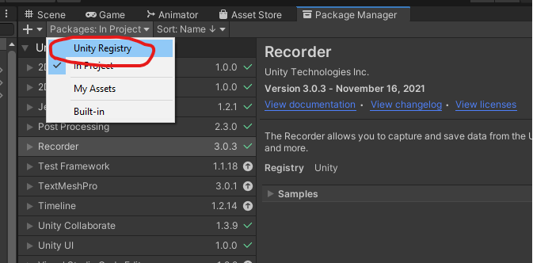
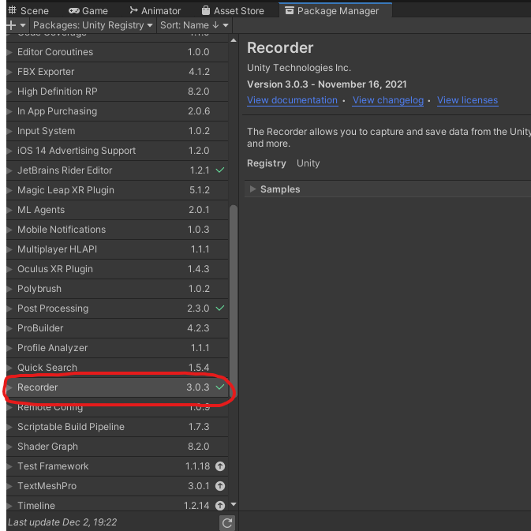
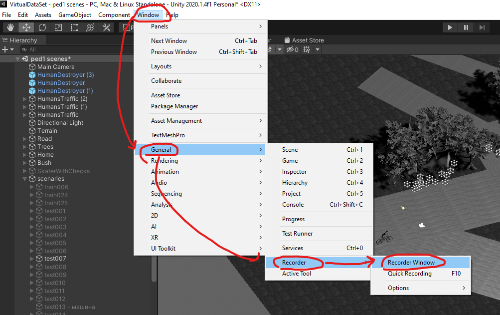
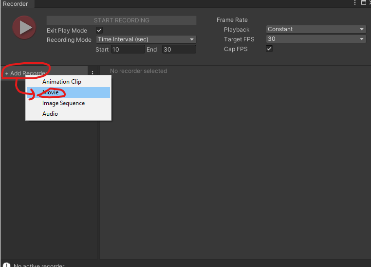
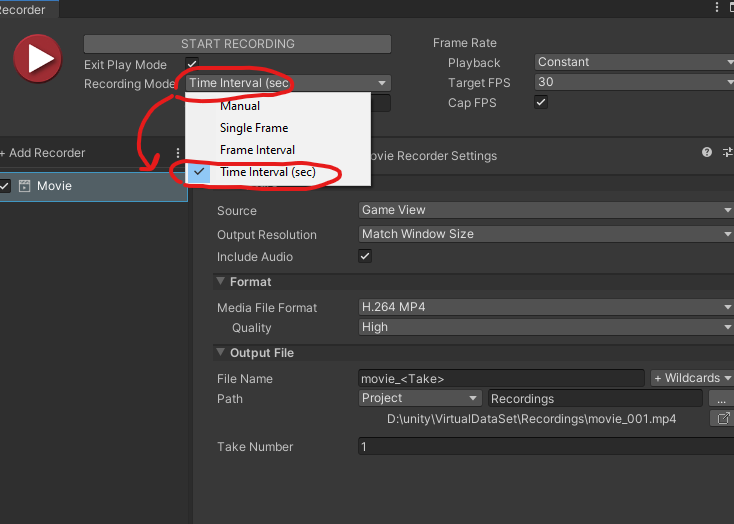
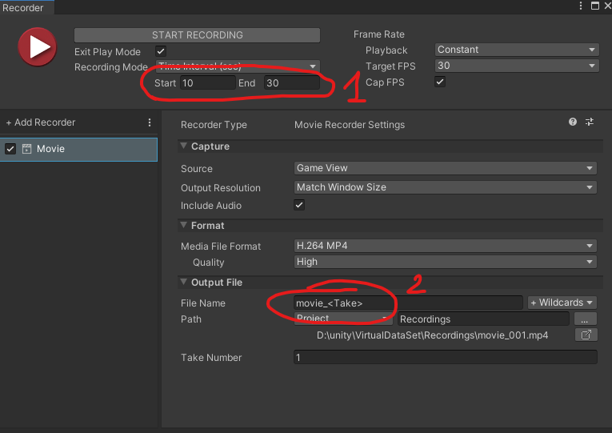
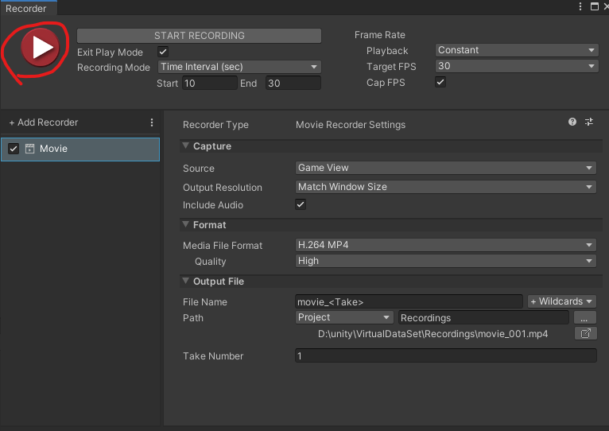

# Полезная иноформация, файлы и ссылки для работы над VirtualDataSet
___
Здесь собирется информация и ссылки на важные для пректа ресурсы и файлы.

____

## Содержание
* [полезные ссылки](#links)
* [description of sitations](#descr)
* [Работа с папкой Видео и нарезкой на кадры](#mp4_conv)
* [установка и работа с Unity Recorder](#un_rec)
___
## <a name="links"></a> Полезные ссылки
* [сжать картинку до нужных размеров](https://www.imgonline.com.ua/resize-image.php) 
* [конвертер mp4 в tiff](https://www.converter365.com/video-converter/mp4/mp4-to-tiff)
* 
____
## <a name="descr"></a> Папка description of sitations 
в ней лежат файлы, написанные Иваном с опсианием ситуаций
___
## <a name="mp4_conv"></a> Папка видео
* скачивется репозиторий
* в папку кладутся видео в .mp4
* запускается файл `mp4_tiff_converter.py`
* для его работы нужны: `numpy`, `PIL`, `opencv`
* обрезка кадров пока не реализована


## Основной файл и работа 
`mp4_tiff_converter.py`

```python
import cv2
import os
from PIL import Image

import image_cutter

path = os.getcwd() + '/video' # папка с видео
os.chdir(path)            # папка с видео - активная
print(os.listdir())       # получаем список файлов

for video in [file for file in os.listdir(path) if file.__contains__('.mp4')]:  # бежим по всем файлам с .mp4
  os.chdir(path)          # папка с видео - активная
  vidcap = cv2.VideoCapture(video)  # открываем видео файл
  success, image = vidcap.read()    # читаем первый кадр
  count = 0
  os.makedirs(video[:-4])           # создаем новую папку для кадров
  os.chdir(path+'/'+video[:-4])     # переходим в папку


  while success:
    vidcap.set(cv2.CAP_PROP_POS_MSEC, (count * 100)) # раз в сколько мс берем кадр.
                                                     # 20 сек видео. 200 кадров, тогда кадр берется раз в 100 мс

    cv2.imwrite("frame%d.tiff" % count, image)

    success,image = vidcap.read()
    count += 1

```

___
## <a name="un_rec"></a> Установка и работа с Unity Recorder
Утилита для записи видео прямо из unity3d
  
  следуем скриншотам  
  во вкладку "package manager" можно еще попасть через "asset store"




устанавливаем 



затем откроется окно рекордера  
добавляем новый рекордер movie - будет снимать видео 

**recording mode** ставим в Time interval, чтобы мы могли записывать нужные нам временные промежутки (удобно для нарезки)

1) время: с какой сек по какую (или мс, пока не уверен) на данный момент нас интересует 20 сек промежуток
2) имя файла и путь: тут все понятно

чтобы начать записть. нажать на эту кнопку. Игровой мод в режиме записи откроется сам.
  
**ВНИМАНИЕ!** Чтобы работа скриптов при записи была корректна, нужно исправить скрипт `TargetedNavMeshControl.cs`  
в методе `void Update()`  
~~`seconds += 0.03f;`~~ заменить на `seconds +=  Time.deltaTime;`